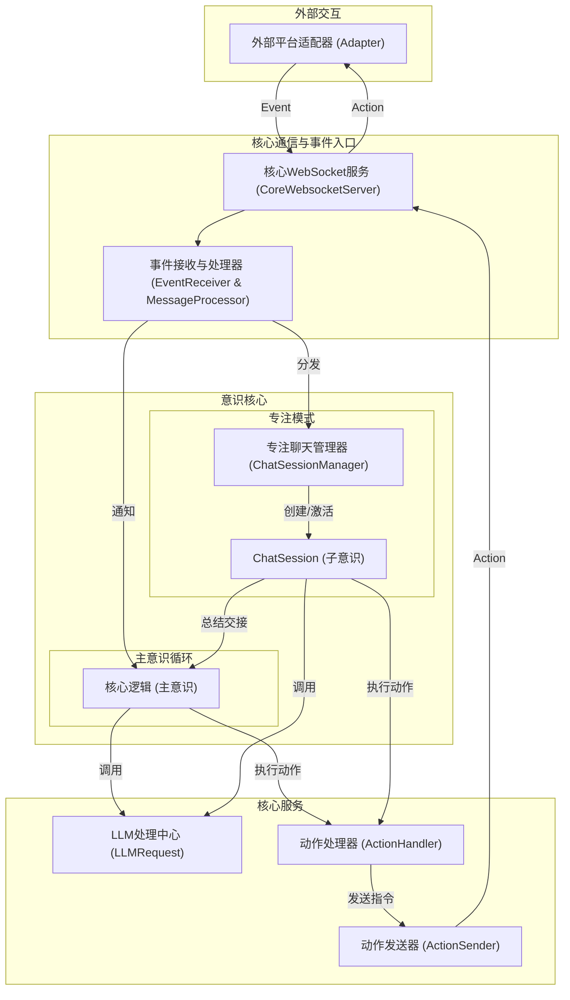

# **AIcarusCore - 多层意识AI框架**

AIcarusCore 是一个高度模块化、可扩展的AI认知框架。它不仅仅是一个聊天机器人后端，更是一个模拟多层意识结构、旨在实现更动态、更具自主性AI行为的实验性平台。

其核心设计理念在于将AI的“思考”与“行动”分离，并引入“主意识”与“子意识（专注模式）”的概念，构建了一个能够处理并发信息流、并根据内部状态和外部刺激动态调整其注意力的复杂系统。

## ✨ 核心特性

*   **多层意识架构**:
    *   **主意识流 (`CoreLogic`)**: 系统的核心思考循环。在没有特定对话任务时，它会周期性地审视全局信息（如未读消息摘要、平台连接状态、历史行动结果），并进行宏观的、发散性的思考，决定是否要将注意力投入到某个具体的会话中。
    *   **专注聊天模式 (`FocusChatMode`)**: 当主意识决定进入某个会话时，会激活一个独立的“子意识”——`ChatSession`。这个子意识会全权负责处理该会话的上下文、进行高频次的对话交互，直到它认为该会话可以告一段落，再将总结和最终状态“交接”回主意识。

*   **动态平台与动作系统**:
    *   **平台无关设计**: Core本身不包含任何特定平台（如QQ、Discord）的硬编码逻辑。
    *   **平台构建器 (`PlatformBuilders`)**: 通过可插拔的“平台构建器”，Core可以动态地了解每个平台支持哪些动作（如`send_message`, `kick_member`）以及这些动作需要什么参数。
    *   **LLM驱动的动作决策**: 当AI产生行动意图时，`ActionHandler` 会将所有可用平台的、所有可用动作的定义，动态组合成一个“超级工具列表”交给LLM，由LLM根据当前意图选择最合适的平台和动作进行调用。

*   **智能中断与侵入性思维**:
    *   **智能中断系统 (`IIS`)**: 一个基于语义和马尔可夫链的复杂模型，能够实时评估新消息的“意外度”和“重要性”。当一个新消息的得分超过阈值时，它能主动“打断”AI当前的思考或行动，强制AI重新评估并处理这个高优先级信息，极大地提高了AI的响应真实感。
    *   **侵入性思维 (`IntrusiveThoughts`)**: 一个独立的后台线程，会周期性地生成一些随机的、可能与当前上下文无关的“念头”，并有机会被注入到主意识的思考循环中，为AI带来更多不可预测性和“灵感”。

*   **持久化记忆与状态**:
    *   使用 **ArangoDB** 作为核心数据库，它是一个高性能的多模型NoSQL数据库。
    *   所有事件、思考过程、会话信息、动作日志和总结都会被持久化存储，为AI提供了长期记忆和可供学习的历史数据。

*   **模块化与可扩展性**:
    *   项目结构高度解耦，`core_logic`, `core_communication`, `database`, `focus_chat_mode` 等核心组件职责分明，易于维护和扩展。
    *   通过 `ActionProvider` 和 `PlatformBuilder` 等抽象基类，可以轻松地为系统添加新的内部工具或支持新的聊天平台。

## 🏛️ 架构概览

以下是使用 Mermaid 绘制的架构概览图：



## 🚀 快速启动

1.  **环境准备**:
    *   安装 Python 3.12 或更高版本。
    *   安装 ArangoDB 数据库并确保其正在运行。
    *   安装项目依赖：`pip install -r requirements.txt`。

2.  **配置**:
    *   首次运行 `run_core_logic.py` 会在项目根目录的 `config` 文件夹下生成 `config.toml`。
    *   根据 `template/config_template.toml` 的注释，填写你的配置，特别是：
        *   `[server]`: Core WebSocket 服务器的监听地址和端口。
        *   `[persona]`: AI的人设信息。
        *   `[llm_models]`: 配置你用于不同任务（主意识、专注聊天、总结等）的LLM模型。
    *   在项目根目录创建 `.env` 文件，并填入你的服务密钥，例如：
        ```env
        GEMINI_KEY="your_gemini_api_key"
        OPENAI_KEY="your_openai_api_key"
        # 数据库连接信息也推荐在此处配置
        ARANGODB_HOST="http://localhost:8529"
        ARANGODB_USER="root"
        ARANGODB_PASSWORD="your_db_password"
        ARANGODB_DATABASE="aicarus_core"
        ```

3.  **运行**:
    ```bash
    python run_core_logic.py
    ```

## 🤝 贡献

欢迎任何形式的贡献！如果你有任何问题、功能建议或发现了 bug，请通过提交 Issue 或 Pull Request 的方式告知我们。

## 许可证

本项目基于 **GPL-3.0** 许可证开源。