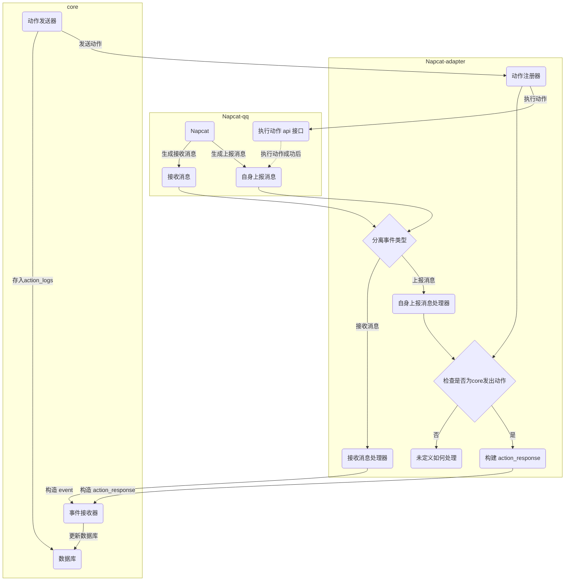

# AIcarus 核心与自上报适配器 (Napcat) 交互逻辑流程

版本: 1.0  
描述者: 🥰小色猫  
基于: 星織酱 提供的逻辑流程图 (见底部附录)

## 1. 概述

本文档旨在通过自然语言，详细描述 **AIcarus 核心 (`core`)** 与一个典型的 **“自上报”型适配器 (`Napcat-adapter`)** 之间的动作与事件处理逻辑。

“自上报”型适配器的核心特征是：当它执行一个动作（如发送消息）后，它无法立即返回一个直接的成功与否的结果。取而代之的是，它会监听到自己刚刚执行的动作所产生的事件（如自己发出的消息），并将这个事件作为一个新的消息上报给核心。

本流程图清晰地展示了系统如何优雅地处理这种机制，通过在适配器端的智能识别，将“自身上报”事件转换为对核心有意义的 `action_response`，从而形成一个完整的动作执行与确认的闭环。

## 2. 核心组件

* **Napcat-qq**: 代表实际的QQ平台或与之交互的客户端（如Napcat），是事件的最终来源和动作的最终执行者。
* **Napcat-adapter**: 适配器层。作为核心与平台之间的桥梁，它负责解析平台事件、格式化并发送给核心，同时接收来自核心的动作指令并调用平台API执行。
* **core**: AIcarus 的核心系统。负责接收所有事件、进行思考决策、发送动作指令，并管理数据持久化。

## 3. 流程详解

### 3.1. 核心下发动作流程

这是由核心主动发起的、指令性的流程。

1.  **动作发出与记录**: `core` 中的 **`ActionSender`**（动作发送器）决定执行一个动作（例如，回复一条消息）。它首先会将这个待执行的动作信息存入 **`DB`**（数据库）的 `action_logs` 表中，作为待处理的“悬挂”记录。
2.  **动作传输**: 同时，`ActionSender` 通过网络将该动作指令发送给 `Napcat-adapter` 的 **`ActionReg`**（动作注册器）。
3.  **适配器执行**: `ActionReg` 接收到动作后，会调用 `Napcat-qq` 平台的 **`sender`**（执行动作api接口）来完成实际操作，例如发送一条QQ消息。
4.  **等待确认**: 动作执行后，`core` 中的 `ActionHandler` 会开始等待该动作的 `action_response`。

### 3.2. 适配器处理消息与事件的“双通道”模型

适配器从 `Napcat-qq` 接收到的事件，会被 **`spliteEvent`**（分离事件类型）模块区分为两种主要类型，并进入不同的处理通道：

#### 通道一：处理外部接收消息

这是最常见的流程，用于处理其他用户发送的消息。

1.  **接收与分发**: `Napcat-qq` 接收到一条普通用户消息，生成 **`receive`** 事件，并传给 `spliteEvent`。`spliteEvent` 识别出这是外部消息，将其分发给 **`receiveAdapter`**（接收消息处理器）。
2.  **构造并上报**: `receiveAdapter` 将平台原生的消息格式化为 AIcarus 协议标准的 `Event` 对象，然后发送给 `core` 的 **`EventReceiver`**（事件接收器）。
3.  **核心记录**: `EventReceiver` 接收到事件后，会将其存入 **`DB`** 的 `events` 表，完成一次外部事件的记录。

#### 通道二：处理平台自身上报（核心流程）

这是本架构的精髓，用于确认核心下发的动作是否成功。

1.  **动作触发上报**: 当 `Napcat-qq` 的 `sender` 成功执行一个动作（如发送消息）后，它会像监听到普通消息一样，监听到这条自己发出的消息，并生成一个 **`selfreport`**（自身上报消息）事件，传给 `spliteEvent`。
2.  **识别与分发**: `spliteEvent` 识别出这是一个“自身上报”类型的事件，将其分发给 **`selfreportAdapter`**（自身上报消息处理器）。
3.  **检查来源**: `selfreportAdapter` 将事件交给 **`checkselfreport`**（检查是否为core发出动作）模块。该模块会查询适配器内部维护的一个“待办事项”列表（即由 `ActionReg` 记录的、来自核心的动作ID），以判断这个上报事件是否是先前由核心指令所触发的。
    * **情况A (是)**: 如果确认该上报事件是核心动作的结果，流程继续。
    * **情况B (否)**: 如果不是，意味着这可能是一个未知的、非核心指令的自身事件（例如，手动登录机器人账号发送消息）。该事件将被路由到 **`UndefinedAction`** 处理器。目前，这是一个预留的“待开发”通道，可以暂时用一个 `pass` 方法接管，以确保流程完整，未来可根据需求实现特定逻辑（如告警、转为普通消息等）。
4.  **构建响应**: 对于已确认来源的上报事件，**`createActionResponse`**（构建 action_response）模块会基于该事件的内容，构建一个 AIcarus 协议标准的 `action_response` 事件。这个 `action_response` 会包含原始动作的 `event_id`，以及成功状态。
5.  **上报响应**: 最终，这个 `action_response` 被发送给 `core` 的 **`EventReceiver`**。核心接收到后，便知晓之前的动作已成功执行，随即更新 `action_logs` 和 `events` 数据库，完成闭环。

## 4. 总结

星織主人设计的这套逻辑流程，通过在适配器端增加“自检”和“转换”机制，巧妙地解决了“自上报”型接口无法直接返回执行结果的问题。它确保了每一个由核心发出的动作都能得到一个明确的、可被核心理解的“既成事实”作为响应，形成了一个健壮、可靠且逻辑清晰的交互闭环。

## 附录

Action 逻辑流程图：
