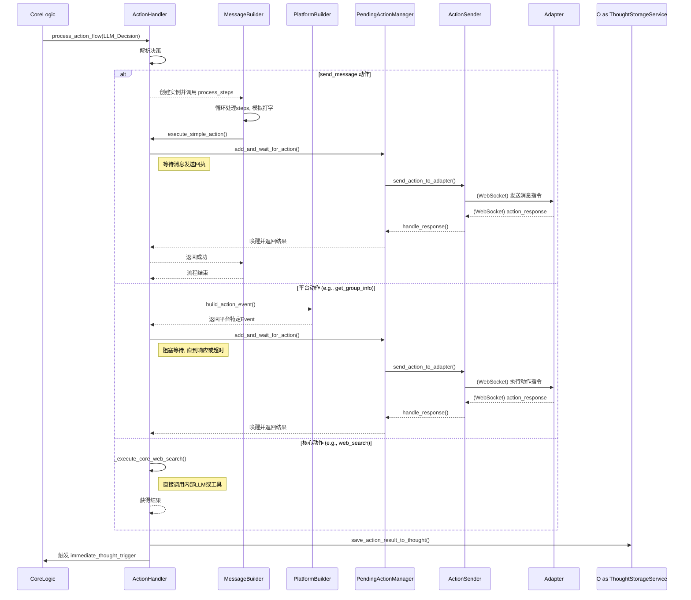

# 动作处理子系统 (Action Subsystem)

`action` 模块是 AIcarusCore 的执行中枢。当核心逻辑 (`core_logic`) 经过思考决定采取行动后，具体的执行流程就全权委托给了本模块。它确保了 AI 的决策能够被准确地翻译、发送、追踪，并处理其执行结果。

## 核心组件与职责

- `action_handler.py` (**ActionHandler**): **动作总指挥**

  - **核心职责**: 接收来自 `core_logic` 的完整 LLM 决策 JSON。它是整个模块的入口和协调者。
  - **工作流程**:
    1.  **解析决策**: 分析 LLM 输出的 `action` 部分，识别出具体的动作指令（如 `send_message`, `web_search`）。
    2.  **分发任务**: 根据动作类型，将任务分派给不同的内部流程。
        - 对于平台特定动作（如 `send_message`），它会查找 `platform_builders` 将通用指令翻译成平台专属事件。
        - 对于核心内部动作（如 `web_search`），它会直接调用相应的内部服务。
        - 对于特殊的 `send_message` 流程，它会实例化 `MessageBuilder` 进行精细化处理。
    3.  **结果回写**: 动作执行后（无论是立即返回还是异步响应），`ActionHandler` 确保结果被记录回触发该动作的“思想点”(`ThoughtChainDocument`)中，完成信息闭环。
    4.  **唤醒思考**: 动作流程处理完毕后，它负责设置 `thought_trigger` 事件，唤醒 `core_logic` 开启新一轮的思考。

- `components/pending_action_manager.py` (**PendingActionManager**): **异步任务追踪器**

  - **核心职责**: 管理所有需要等待外部适配器响应的异步动作。
  - **工作流程**:
    1.  **登记与等待**: 当 `ActionHandler` 发出一个需要响应的动作（如 `get_group_info`）时，`PendingActionManager` 会为该动作创建一个 `asyncio.Future` 对象，并以 `action_id` 作为钥匙存起来。然后，它会 `await` 这个 `Future` 对象。
    2.  **超时监控**: `await` 操作被 `asyncio.wait_for` 包裹，如果超过预设时间（例如 30 秒）仍未收到响应，任务将超时失败。
    3.  **响应匹配**: 当 `core_communication` 层收到一个 `action_response` 事件时，会调用 `PendingActionManager` 的 `handle_response` 方法。该方法会根据响应中的 `original_event_id` 找到对应的 `Future`。
    4.  **唤醒任务**: 找到 `Future` 后，`PendingActionManager` 会将响应结果（成功或失败）设置到 `Future` 上，从而唤醒之前被 `await` 阻塞的 `ActionHandler` 流程，使其可以继续执行。

- `components/message_builder.py` (**MessageBuilder**): **精细化消息构造器**

  - **核心职责**: 专门处理复杂的 `send_message` 动作。LLM 可以通过一个指令序列（`steps`）来构建包含文本、@、回复等元素，甚至分多条发送的消息。
  - **工作流程**:
    1.  **解析步骤**: 逐一读取 `steps` 数组中的指令 (`command`) 和参数 (`params`)。
    2.  **构建消息段**: 根据指令（如 `text`, `at`, `reply`），将内容构建成标准的 `Seg` 对象，并暂存在内部的 `_current_segments` 列表中。
    3.  **模拟打字延迟**: 在发送消息前，会根据文本内容计算并 `await asyncio.sleep()` 一个模拟的打字延迟，使 AI 的行为更具人性化。
    4.  **发送与分割**: 遇到 `send_and_break` 指令或处理完所有步骤后，它会将当前 `_current_segments` 列表中的所有内容打包成一条消息，通过 `action_handler` 的简化接口发送出去。`send_and_break` 会清空列表，以便构建下一条消息。

- `components/llm_client_factory.py` (**LLMClientFactory**): **LLM 客户端工厂**

  - **核心职责**: 集中管理和创建不同用途的 `LLMProcessorClient` 实例。
  - **工作流程**: 根据传入的用途标识（如 `"web_search_agent"`），从主配置文件 (`config.toml`) 的 `[llm_models]` 部分查找对应的模型配置，并用这些参数创建一个专用的 `LLMProcessorClient` 实例。这使得不同任务可以使用不同模型、不同参数，实现了 LLM 资源的灵活配置。

- `action_provider.py` & `components/action_registry.py`: (已废弃/演进)
  - **历史职责**: 在项目的早期版本中，这套组件可能用于实现一个更通用的插件化动作系统。
  - **当前状态**: 在当前的代码结构中，动作的定义和实现被更直接地整合到了 `platform_builders` 和 `ActionHandler` 的内部逻辑中。`ActionProvider` 和 `ActionRegistry` 目前并未被核心流程所使用，但其设计思想为未来可能的插件化扩展保留了可能性。

## 模块交互图

该模块通过清晰的职责划分，确保了 AI 的行动意图能够被高效、可靠地执行，是连接 AI 思考与现实世界的坚实桥梁。
