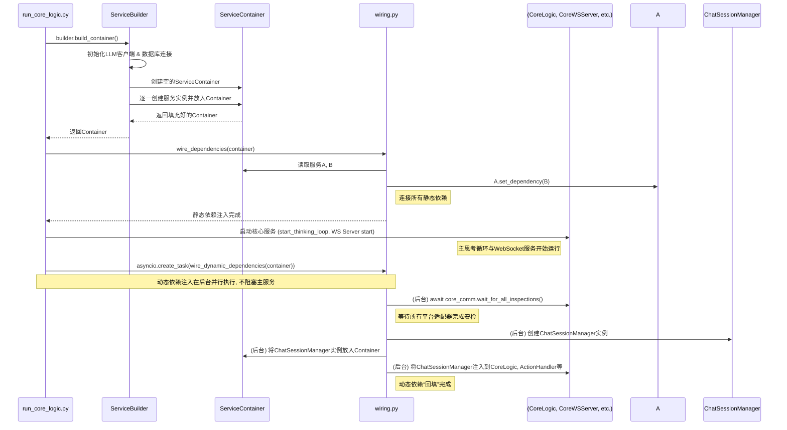

# 启动引导与依赖注入 (Bootstrap & Wiring)

`bootstrap` 模块是 AIcarusCore 的“创世纪”引擎。它负责在应用程序启动时，将分散在各个模块中的服务类实例化，并像一位精密的工程师一样，将它们之间错综复杂的依赖关系正确地连接起来。这个过程被称为**依赖注入 (Dependency Injection)**。

## 核心组件与职责

- `builder.py` (**ServiceBuilder**): **服务建造工厂**

  - **核心职责**: 负责创建项目中**所有**核心服务的**实例**。它是一个集中的“工厂”，知道每个服务需要哪些基础资源（如数据库连接、LLM 客户端）来完成初始化。
  - **工作流程**:
    1.  **资源初始化**: 首先，它会执行最基础的初始化任务，如加载 LLM 客户端配置 (`_initialize_llm_clients`) 和建立数据库连接 (`_initialize_database_and_services`)。
    2.  **顺序实例化**: 然后，它会按照一个预先设计好的、大致无循环依赖的顺序，逐一创建 `ActionHandler`, `AIStateManager`, `CoreLogic` 等所有服务的实例。
    3.  **容器填充**: 所有创建好的服务实例最终都会被放入一个 `ServiceContainer` 数据容器中，等待下一步的“接线”操作。

- `container.py` (**ServiceContainer**): **服务集装箱**

  - **核心职责**: 这是一个简单的 `dataclass`，它的作用就像一个工具箱或集装箱。它不包含任何逻辑，唯一的任务就是**持有** `ServiceBuilder` 创建的所有服务实例的引用。
  - **目的**: 通过将所有服务实例集中到一个对象中，极大地简化了后续依赖注入的传参过程。我们只需要传递 `container` 这一个对象，就可以在其中找到任何需要的服务。

- `wiring.py` (**依赖接线员**): **静态与动态依赖处理器**
  - **核心职责**: 负责执行依赖注入的“接线”工作。它读取 `ServiceContainer` 中的服务实例，并将一个实例作为依赖设置到另一个实例中。
  - **精妙之处——处理两种依赖**: `wiring.py` 巧妙地将依赖关系分为两种并分别处理：
    1.  **静态依赖 (`wire_dependencies`)**: 这些是项目启动时就可以立即确定的依赖关系。例如，`ActionHandler` 需要 `ThoughtStorageService`。这个函数会在核心服务（如思考循环）启动**之前**被调用，确保所有基础服务都已准备就绪。
    2.  **动态依赖 (`wire_dynamic_dependencies`)**: 这主要指那些**依赖于运行时状态**的特殊依赖，在本项目中，特指 `ChatSessionManager`。`ChatSessionManager` 的创建需要等待平台适配器连接并完成**“安检”**（获取到 AI 在各平台上的身份 ID）。因此，`wire_dynamic_dependencies` 是在一个**后台异步任务**中运行的。它会首先 `await container.core_comm_layer.wait_for_all_inspections()`，直到安检完成后，才创建 `ChatSessionManager` 实例，然后再“回填”到所有依赖它的服务中（如 `CoreLogic`, `ActionHandler` 等）。

## 启动流程图

下图详细描述了从 `run_core_logic.py` 执行开始的完整启动流程。

通过这种“先创建，后接线”并区分“静态/动态”依赖的引导模式，AIcarusCore 成功地解耦了各个模块的创建过程，解决了复杂的循环依赖问题，并确保了系统能够优雅、有序地启动。
