# 智能打断系统 (IIS) - “小色猫”版 使用说明文档

本文档详细介绍了 AIcarus Core 内核中的智能打断系统（Intelligent Interrupt System, IIS）的架构、使用方法和未来展望。该系统由一个究极进化的性感判断器 `IntelligentInterrupter` 驱动，旨在为AI提供近乎人类的、基于上下文的干扰判断能力。

## 1. 系统概述

本系统代号“小色猫”，其核心目标是解决一个关键问题：AI在执行长任务或沉浸于自身思考时，应在何时被外部信息（如新的群聊消息）打断？

一个优秀的打断机制应避免：
*   **过度敏感**：对任何风吹草动都做出反应，导致任务频繁中断，无法专注。
*   **过度迟钝**：对真正紧急或重要的信息毫无反应，错过关键的响应时机。

“小色猫”通过一个多层次、可配置的评分模型，结合**上下文关联性**、**内容重要性**和**发言人权重**，综合判断每一条新信息的“打断价值”。

## 2. 核心组件与数据流

系统的运作依赖于几个关键组件的紧密配合。下方是其数据流的UML类图表示：

```mermaid
classDiagram
    direction LR

    class UserInput {
        <<External>>
        +speaker_id: str
        +message_text: str
    }

    class IISBuilder {
        -event_storage: EventStorageService
        -base_semantic_model: SemanticModel
        +get_or_create_model(): SemanticMarkovModel
    }

    class EventStorageService {
        <<Database>>
        +stream_all_textual_messages_for_training(): list[str]
    }

    class SemanticMarkovModel {
        <<Model>>
        -kmeans: KMeans
        -transition_matrix: np.ndarray
        -semantic_model: SemanticModel
        +train(text_list)
        +calculate_contextual_unexpectedness(current_text, previous_text): float
    }

    class IntelligentInterrupter {
        <<Core Logic>>
        -semantic_markov_model: SemanticMarkovModel
        -speaker_weights: dict
        -objective_keywords: list
        -core_importance_concepts: list
        -last_message_text: str
        +should_interrupt(message: dict): bool
    }

    class Config {
        <<Configuration>>
        +speaker_weights
        +objective_keywords
        +core_importance_concepts
        +final_threshold
        +alpha
        +beta
    }
    
    UserInput --|> IntelligentInterrupter : (1) 传入新消息
    IntelligentInterrupter --|> SemanticMarkovModel : (2) 请求计算意外度
    SemanticMarkovModel --|> SemanticModel : (内部依赖)
    IISBuilder --|> EventStorageService : (A) 请求训练数据
    EventStorageService --|> IISBuilder : (B) 返回历史消息
    IISBuilder --|> SemanticMarkovModel : (C) 创建并训练模型
    SemanticMarkovModel --|> IISBuilder : (D) 返回训练好的模型实例
    IISBuilder --|> IntelligentInterrupter : (E) 注入模型
    Config --|> IntelligentInterrupter: (F) 注入配置

```



**数据流说明:**

1.  **模型构建时 (A -> B -> C -> D):**
    *   `IISBuilder` 向 `EventStorageService` 请求所有历史对话文本。
    *   `IISBuilder` 使用这些文本来创建并训练一个 `SemanticMarkovModel` 实例。这个过程包括：
        1.  使用 `SemanticModel` 将所有文本编码为向量。
        2.  使用 `KMeans` 算法对向量进行聚类，形成“语义状态”。
        3.  构建一个状态转移概率矩阵。
    *   训练好的 `SemanticMarkovModel` 实例被序列化并保存到磁盘 (`semantic_markov_memory.pkl`)，以备后用。

2.  **系统运行时 (E -> F -> 1 -> 2):**
    *   在系统启动时，`IISBuilder` 会加载或重新构建 `SemanticMarkovModel`，并连同 `Config` 文件中的配置，一起注入到 `IntelligentInterrupter` 实例中。
    *   当外部传来一条新消息 `UserInput` 时，它被送入 `IntelligentInterrupter` 的 `should_interrupt` 方法。
    *   `IntelligentInterrupter` 会调用 `SemanticMarkovModel` 的方法来计算分数，并结合自身逻辑，最终输出一个布尔值，决定是否中断。

## 3. 使用方法与配置

### 3.1. 如何调用

在系统的主逻辑中，你需要持有一个 `IntelligentInterrupter` 的单例。在每个事件循环或消息处理流程中，将新消息构造成一个字典，并调用其 `should_interrupt` 方法。

**传入数据格式:**

```python
# 一个包含了说话人ID和消息文本的字典
message = {
    "speaker_id": "主人",
    "text": "服务器好像有点问题，你快看看！"
}
```

**调用示例:**

```python
# interrupt_model_instance 是已初始化好的 IntelligentInterrupter
if interrupt_model_instance.should_interrupt(message):
    print("决策：中断当前任务，处理新消息！")
    # ... 执行中断逻辑 ...
else:
    print("决策：无需中断，继续当前任务。")

```
**重要提示:** `IntelligentInterrupter` 实例是**有状态的**，它内部会记录 `last_message_text`。请确保在整个应用生命周期中使用同一个实例，以保证上下文判断的连续性和准确性。

### 3.2. 配置文件详解

所有关键参数都在 `config.yml` (或相应的配置文件) 中定义，方便动态调整模型的行为，无需修改代码。

```yaml
# config.yml

interrupt_model:
  # Alpha: 上下文意外度得分的权重
  alpha: 0.5
  # Beta: 内容核心重要性得分的权重
  beta: 0.5
  # 最终得分超过此阈值，则建议中断
  final_threshold: 90
  
  # 发言人权重列表，ID是发言者的唯一标识，weight是乘数因子
  speaker_weights:
    - id: "主人"
      weight: 2.0
    - id: "未來星織"
      weight: 1.5
    - id: "小助手"
      weight: 1.0
    - id: "路人甲"
      weight: 0.7
    - id: "default"  # 务必提供一个默认权重
      weight: 1.0

  # 客观关键词列表，任何消息包含这些词，都会触发强制中断
  objective_keywords:
    - "紧急"
    - "立刻"
    - "马上"
    - "救命"
    - "！！！" # 也可以是符号

  # 核心重要性概念列表，用于计算内容重要性得分
  core_importance_concepts:
    - "项目截止日期"
    - "服务器崩溃"
    - "核心Bug"
    - "安全漏洞"
    - "数据库连接失败"
```

## 4. 未来展望 (Future Work)

在我们充满激情的讨论中，我们构思了一个更加性感、更加高效的进化方向：

### **Feature: 预计算并持久化句子向量**

*   **当前瓶颈:**
    目前，`IISBuilder` 每次构建模型时，都需要实时地将数据库中全部历史消息进行 `encode`（编码为向量），这个过程在数据量大时会非常耗时，极大地延长了系统的冷启动或模型更新时间。

*   **进化构想:**
    我们可以改造事件存储的流程。在消息**初次存入数据库时**，就立即调用 `SemanticModel` 将其文本内容计算为句子向量，并将这个向量作为一个**新的字段**与原始消息一同存储。

*   **带来的快感 (优点):**
    1.  **极速训练:** `IISBuilder` 在构建模型时，可以直接从数据库中批量读取预计算好的向量，跳过最耗时的 `encode` 步骤，训练时间将从分钟级锐减至秒级。
    2.  **计算复用:** 预存的向量可以在未来用于其他需要语义理解的功能（如语义搜索、内容推荐等），实现“一次计算，处处可用”。

*   **需要付出的代价 (挑战):**
    1.  **存储开销:** 数据库的体积会显著增大。
    2.  **写入延迟:** 消息写入时会增加一次向量计算的耗时。
    3.  **模型升级成本:** 如果未来更换了底层的语义模型，所有已存储的向量将失效，需要进行一次大规模的“重新计算”和数据迁移。这可以通过增加 `embedding_model_version` 字段和后台异步更新任务来缓解。

这个进化方向代表了系统向着更高性能、更专业架构迈进的关键一步。