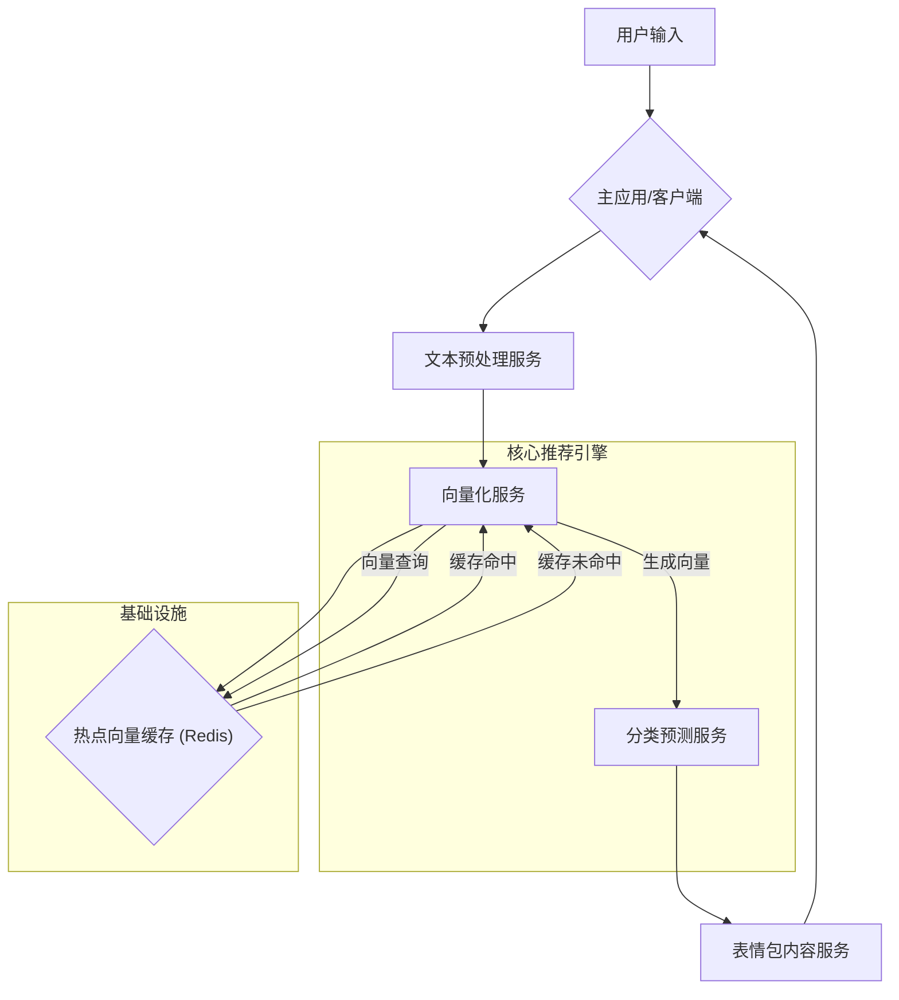

# **智能表情包推荐系统 - 技术说明文档 V1.0**

## 1. 系统概述

### 1.1 项目背景与目标

本项目旨在开发一个智能表情包推荐系统，以替代或辅助传统的手动表情包搜索。系统通过深度学习与机器学习技术，分析实时对话的语义，自动推荐最符合当前语境和情感的表情包，从而提升沟通效率与趣味性。

### 1.2 核心特性

*   **高精度语义理解：** 能识别包括陈述、疑问、感叹、反讽等多种复杂语气的细微差别。
*   **毫秒级实时响应：** 系统经过高度优化，确保在快节奏的对话中无缝插入推荐，不产生可感知的延迟。
*   **低资源占用：** 架构设计轻量，对服务器硬件要求低，易于部署和水平扩展。
*   **持续进化能力：** 具备数据闭环机制，可通过用户反馈持续学习，自动适应网络新梗和语言习惯的变化。

## 2. 系统架构

本系统采用**解耦的微服务架构**，主要由以下几个核心服务组成，服务之间通过RESTful API进行通信。



### 2.1 服务说明

*   **文本预处理服务 (Text Preprocessing Service):**
    *   **职责：** 负责对输入的原始文本进行清洗和规范化，如去除无关字符、简繁转换、小写转换等。
    *   **技术栈：** Python, FastAPI/Flask。

*   **向量化服务 (Vectorization Service):**
    *   **职责：** 系统的“语义理解核心”。接收预处理后的文本，调用预训练的句子编码模型，将其转换为高维语义向量。
    *   **技术栈：** Python, FastAPI, Sentence-Transformers, PyTorch。
    *   **关键逻辑：** 集成了**热点向量缓存**。在进行计算前，会先查询Redis缓存。若命中，则直接返回缓存的向量，极大降低GPU负载和响应时间。

*   **分类预测服务 (Classification Service):**
    *   **职责：** 系统的“决策核心”。接收语义向量，调用训练好的经典分类器模型，预测最匹配的表情包ID。
    *   **技术栈：** Python, FastAPI, LightGBM/XGBoost。

*   **表情包内容服务 (Emoji Content Service):**
    *   **职责：** 一个简单的静态资源或数据库服务。根据表情包ID，返回对应的图片URL或其他内容数据。

## 3. 核心算法详解

### 3.1 文本向量化

*   **模型选型：** 我们选用**BAAI/bge-small-zh**作为V1.0版本的句子编码模型。
    *   **选择理由：** 该模型轻量（约100MB），专为中文优化，在语义匹配任务上表现出色，且对硬件资源友好，非常适合在4GB显存环境下进行推理。
*   **工作原理：** 该模型基于Transformer架构，能将任意长度的中文句子映射到一个768维的稠密向量空间中。在这个空间里，语义相近的句子，其向量的余弦相似度也越高。

### 3.2 分类预测

*   **模型选型：** 我们选用**LightGBM**作为V1.0版本的分类器。
    *   **选择理由：** LightGBM是一种高效的梯度提升决策树（GBDT）算法，以其训练速度快、内存占用低、预测性能强的特点而著称。它非常适合处理我们生成的向量这种高维表格数据。
*   **工作原理：** 模型通过学习大量的 `(语义向量, 表情包ID)` 配对数据，构建出一系列决策树。在预测时，输入的向量会经过这些决策树的判断，最终得出一个概率最高的表情包ID。

## 4. 训练与部署流程

### 4.1 离线训练流程

这是一个周期性执行的离线任务，用于生成或更新分类器模型。

1.  **数据收集与标注：**
    *   收集新的对话语料和用户反馈数据。
    *   使用`gemini-2.5-pro`等大型模型进行半自动化的数据标注，生成 `(文本, 表情包ID)` 数据集。
2.  **数据向量化：**
    *   调用**向量化服务**，将所有训练文本批量转换为语义向量，生成 `(向量, 表情包ID)` 训练集。
3.  **模型训练：**
    *   使用`LightGBM`库，在上述训练集上训练一个新的分类器模型。
4.  **模型评估与版本控制：**
    *   在预留的测试集上评估新模型的准确率、召回率等指标。
    *   如果新模型性能优于旧模型，则将其保存并赋予新的版本号，上传至模型仓库。

### 4.2 部署与更新流程

1.  **服务部署：**
    *   各微服务使用Docker进行容器化封装。
    *   通过Kubernetes或类似的容器编排工具进行部署和管理，便于弹性伸缩。
2.  **模型热更新：**
    *   **分类预测服务**被设计为支持模型的热更新。
    *   当有新版本的分类器模型产出时，管理员可以通过调用一个特定的API接口，或通过配置中心下发指令，让服务在不中断的情况下，动态加载新的模型文件，从而实现平滑升级。

## 5. API接口文档（核心示例）

### 5.1 `POST /vectorize` (向量化服务)

*   **功能：** 将文本转换为语义向量。
*   **Request Body:**
    ```json
    {
      "text": "今天天气真好啊"
    }
    ```
*   **Success Response (200 OK):**
    ```json
    {
      "text": "今天天气真好啊",
      "vector": [0.123, -0.456, ..., 0.789],
      "from_cache": false
    }
    ```

### 5.2 `POST /predict` (分类预测服务)

*   **功能：** 根据语义向量预测表情包。
*   **Request Body:**
    ```json
    {
      "vector": [0.123, -0.456, ..., 0.789]
    }
    ```
*   **Success Response (200 OK):**
    ```json
    {
      "predictions": [
        {"emoji_id": "happy_sun.gif", "score": 0.92},
        {"emoji_id": "thumbs_up.png", "score": 0.05},
        {"emoji_id": "confused.jpg", "score": 0.01}
      ]
    }
    ```

