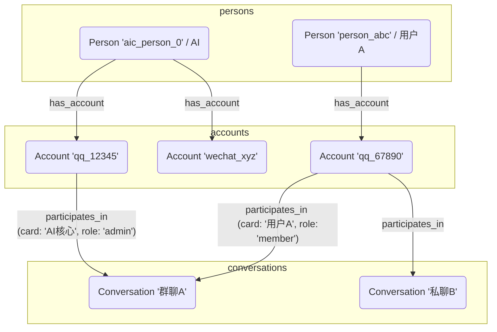
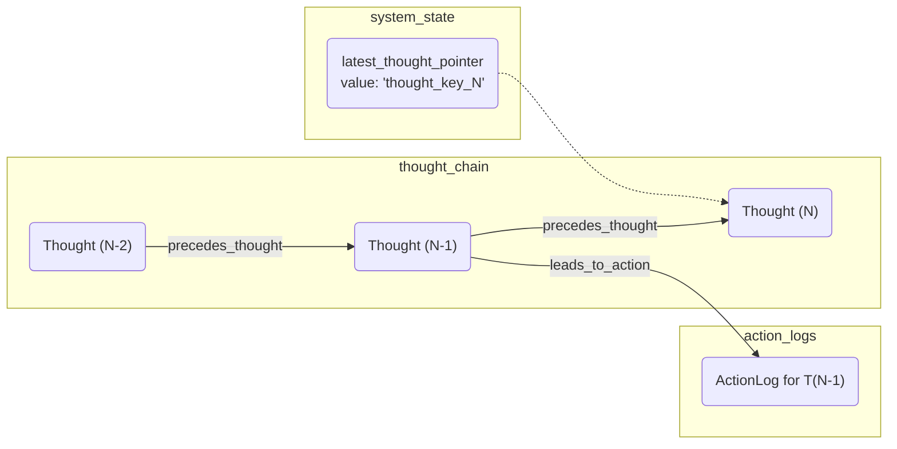

# 数据库 Schema 与记忆结构

`database` 模块定义了 AIcarusCore 的记忆结构和持久化方案。它基于 **ArangoDB** 图数据库，不仅仅是简单地存储数据，更是为了构建实体之间的复杂关系网络，从而为 AI 提供一个可供推理和回溯的记忆图谱。

## 核心设计：图数据库模型

我们使用图数据库来表示 AI 世界中的核心实体（**点/Vertex**）以及它们之间的关系（**边/Edge**）。

### 实体 (Vertex Collections)

- `persons`: **“人”的抽象档案**。每个独立的意识实体（无论是 AI 自身还是其他用户）都在这里有一个唯一的、与平台无关的档案。`_key` 通常是 `aic_person_0` (代表 AI 自己) 或 `person_<uuid>`。
- `accounts`: **平台的“马甲”**。代表一个“人”在特定平台上的具体账号。例如，`person_0` 可以拥有一个 QQ 账号和一个微信账号。`_key` 通常是 `<platform>_<platform_id>`，如 `napcat_qq_123456`。
- `conversations`: **“聊天会话”档案**。记录了每个群聊或私聊的元信息，如名称、平台，以及 AI 对这个会话的**注意力档案 (AttentionProfile)**。
- `events`: **原始事件流**。所有从适配器接收到的原始事件（消息、通知等）都被不可变地记录在这里。
- `thought_chain`: **AI 的意识流——思想链**。这是整个系统的核心。每一个思考决策都会在这里形成一个“思想点”文档，记录了当时的心情、想法、目标和行动。
- `action_logs`: **行动日志**。详细记录了每一次 AI 尝试执行的动作及其最终状态（成功、失败、超时）。

### 关系 (Edge Collections)

- `has_account` (边): 连接 `persons` 和 `accounts`，表示一个“人”拥有一个“平台账号”。 (`persons` -> `accounts`)
- `participates_in` (边): 连接 `accounts` 和 `conversations`，表示一个“账号”参与了一个“会话”，边的属性中记录了其在该会话的成员信息（如群名片、权限）。
- `precedes_thought` (边): **连接思想链的关键**。连接两个 `thought_chain` 节点，表示一个思考“发生在”另一个思考之前，形成了时间的链条。 (`thought_chain` -> `thought_chain`)
- `leads_to_action` (边): 连接 `thought_chain` 和 `action_logs`，表示一个“思考”导致了一个“行动”。

## 核心图谱与数据结构

### 1. 社交关系图 (`person_relation_graph`)

这张图描述了“谁是谁”以及“谁在哪里”的社交网络。

- 通过这个图，系统可以轻松回答：“用户 A 的所有平台账号是什么？”或“AI 在群聊 A 中的身份是什么？”

### 2. 意识图 (`consciousness_graph`) 与思想链

这是 AIcarusCore 最具创新性的设计。它将 AI 的思考过程本身数据化、结构化。

- **`system_state` 集合**: 这是一个特殊的键值存储集合，只包含一条文档，`_key` 为 `latest_thought_pointer`。它像一个指针，永远指向 `thought_chain` 集合中**最新的那个思想点**的 `_key`。这使得系统可以极快地定位到 AI 当前的意识状态。

- **`thought_chain` 集合**:
  - **结构**: 每个文档都是一个 `ThoughtChainDocument`，记录了单次思考的所有方面。
  - **连接**: 当一个新的思想点被创建时，`ThoughtStorageService` 会：
    1.  从 `system_state` 中读取 `latest_thought_pointer`，找到上一个思想点的 `_key`。
    2.  在 `precedes_thought` 边集合中，创建一条从**上一个思想点**指向**新思想点**的边。
    3.  更新 `system_state` 中的指针，使其指向**新的思想点**。
  - 这个过程通过一个**数据库事务**来保证原子性，确保思想链不会“断裂”。

#### 思想链流程图

- **回溯与分析**: 通过 `precedes_thought` 边，我们可以从最新的思想点开始，一路回溯 AI 的整个思考历史。这对于调试、分析 AI 行为模式，甚至让 AI 进行“自我反思”都提供了强大的数据基础。
- **结果闭环**: `action_result` 字段被设计用来存储动作执行的反馈。当一个异步动作（如联网搜索）完成后，其结果会被写回到触发它的那个 `ThoughtChainDocument` 中，从而完成了“思考->行动->结果->新思考”的完整闭环。

## 数据库服务 (`services/`)

为了解耦业务逻辑和数据库操作，`services/` 目录下的每个文件都封装了对特定集合的操作。例如：

- `person_storage_service.py`: 负责处理 `persons`, `accounts` 以及它们之间 `has_account` 边的所有增删改查逻辑。
- `thought_storage_service.py`: 专门负责思想链的写入（事务性操作）和读取。
- `event_storage_service.py`: 提供高效的事件查询接口，如“获取某会话在某时间戳之后的所有未读消息”。

这种分层设计使得上层逻辑（如 `core_logic`）无需关心具体的数据库查询语言（AQL）或集合名称，只需调用语义清晰的服务方法即可。
