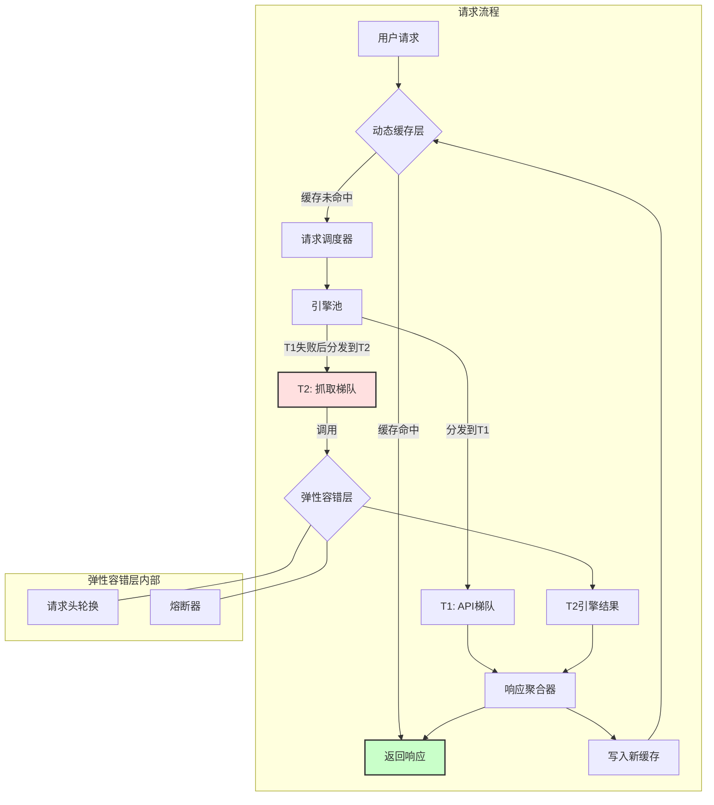

# 高度稳定的分布式元搜索服务模块 - 技术设计文档 (v1.2 - 详细版)

## 1. 概述

### 1.1. 项目目标

本文档旨在设计一个高度稳定、可靠且高性能的元搜索引擎模块。该模块作为后端服务，通过聚合多个第三方搜索引擎的结果，为上层应用（如聊天机器人、智能助理等）提供统一、快速、且经过容错处理的搜索API。

核心设计目标包括：

* **高可用性：** 即使部分下游搜索引擎不可用，模块依然能提供服务。
* **低延迟：** 通过智能缓存和并发请求，最大化地降低用户等待时间。
* **数据新鲜度：** 在保证速度的同时，提供动态策略确保关键信息的时效性。
* **易于扩展：** 可以方便地增加新的搜索引擎或调整策略。

### 1.2. 目标受众

本文档主要面向项目开发者、系统架构师及运维人员，旨在为模块的开发、集成和维护提供清晰的指导。

### 1.3. 术语定义

* **元搜索 (Meta-Search):** 不自行维护索引，而是将用户查询转发给多个第三方搜索引擎，并对结果进行整合的服务模式。
* **引擎 (Engine):** 指代下游的第三方搜索引擎，如Brave Search, DuckDuckGo等。
* **TTL (Time-To-Live):** 缓存条目的存活时间。
* **熔断器 (Circuit Breaker):** 一种软件设计模式，用于在服务调用失败率过高时，自动阻止后续调用，防止级联失败。

## 2. 系统架构

### 2.1. 架构图 (Mermaid)

### 2.2. 组件职责

本模块采用分层、面向服务的架构，主要由以下核心组件构成：

* **动态缓存层 (Dynamic Caching Layer):**
    * **职责:** 作为系统的第一道防线，负责存储和检索搜索结果。它通过智能化的TTL策略，在速度和数据时效性之间取得平衡，是降低延迟和保护下游服务的关键。

* **请求调度器 (Request Dispatcher):**
    * **职责:** 系统的“大脑”，负责决策如何处理一个缓存未命中的请求。它会根据预设的 `分级引擎池` 策略，决定调用哪个或哪些引擎。

* **引擎池 (Engine Pool):**
    * **职责:** 维护所有可用的下游搜索引擎客户端。池中的引擎被明确划分为 `T1 (API)` 和 `T2 (抓取)` 两个梯队，以供调度器调用。

* **弹性容错层 (Resilience Layer):**
    * **职责:** 系统的“安全气囊”，保障T2梯队调用的稳定性。它包含 `请求头轮换` 策略以降低被封禁风险，以及 `熔断器` 模式以隔离故障引擎。

* **响应聚合器 (Response Aggregator):**
    * **职责:** 收集来自一个或多个引擎的搜索结果，进行去重、排序和格式化，最终整合成统一的、对上层应用友好的数据结构。

## 3. 核心策略与实现

### 3.1. 分级引擎池 (Tiered Engine Pool)

为兼顾稳定性和结果多样性，引擎池内的搜索引擎被分为两个优先级：

* **T1 - API优先梯队:**
    * **成员:** 拥有官方API的搜索引擎（如 Brave Search API, Qwant API 等）。
    * **选择依据:** API调用具有明确的契约、可预测的性能和稳定的返回结构，是服务质量的核心保障。

* **T2 - 抓取备用梯队:**
    * **成员:** 需要通过网页抓取（Scraping）获取数据的搜索引擎（如 DuckDuckGo, Startpage 等）。
    * **选择依据:** 作为API引擎结果不佳或不可用时的有效补充，增加搜索结果的多样性。但因其非正式接口，稳定性相对较差。

**调度逻辑:** 调度器总是优先将请求并发发送给所有可用的T1引擎。只有在所有T1引擎均调用失败、超时或未返回结果的情况下，才会启动对T2梯队的调用。

### 3.2. 弹性与容错机制 (Resilience & Fault-Tolerance)

* **请求头轮换策略 (Request Header Rotation Strategy):**
    * **应用对象:** 仅用于T2抓取梯队。
    * **实现:** 维护一个包含多种常见浏览器和设备组合的请求头库。每次对T2引擎发起请求时，从中随机选择一套完整的请求头进行发送。示例请求头包括：
        * `User-Agent`
        * `Accept`
        * `Accept-Language`
        * `Accept-Encoding`
        * `Referer`
        * `DNT` (Do Not Track)
    * **重要限制:** **本策略并非IP轮换的有效替代方案。** 它对于基于IP地址的严格速率限制策略效果有限。因此，必须与下述的“熔断器模式”紧密结合使用。

* **熔断器模式 (Circuit Breaker Pattern):**
    * **应用对象:** 仅用于T2抓取梯队中的每一个独立引擎。
    * **目的:** 防止在某个已失效或不稳定的T2引擎上浪费过多时间与资源。
    * **状态转换详解:**
        1.  **闭合 (Closed):** 默认状态。请求可以正常通过。每次失败，失败计数器增加；每次成功，计数器清零。当失败次数达到阈值（如连续3次），状态切换至`开启`。
        2.  **开启 (Open):** 在此状态下，所有对该引擎的请求将立即失败返回，不会发生网络调用。此状态会持续一个“冷静期”（如5分钟）。
        3.  **半开 (Half-Open):** “冷静期”结束后，熔断器进入此状态，仅放行**一次**试探性请求。若该请求成功，则认为引擎已恢复，状态切换回`闭合`；若失败，则认为引擎仍有问题，状态再次切换回`开启`，并重置“冷静期”。

### 3.3. 动态缓存策略 (Dynamic Caching Strategy)

* **缓存键设计 (Cache Key Design):**
    * 为提高缓存命中率，所有搜索查询在作为缓存键之前，都应进行标准化处理：
        * 转换为小写。
        * 去除首尾空白字符。
        * 将连续的多个空白字符合并为一个空格。
    * 例如，`"  What is ArangoDB? "` 和 `"what is arangodb?"` 应生成相同的缓存键。

* **动态TTL (Dynamic Time-To-Live):**
    * 通过关键词匹配或更复杂的查询分类模型，为不同类型的查询设定不同的缓存时间。

| 查询类别 | 示例关键词 | 建议TTL | 理由 |
| :--- | :--- | :--- | :--- |
| 时事类 | "新闻", "天气", "股价" | 5分钟 | 信息价值随时间快速衰减。 |
| 知识类 | "什么是", "历史", "地球" | 24小时 | 信息内容非常稳定，几乎不变。 |
| 趋势类 | 热门人物, 社交媒体热词 | 1小时 | 在短期内有热度，但会快速过时。 |
| 通用类 | 其他所有查询 | 30分钟 | 作为通用策略，在速度和时效性间取得平衡。 |

* **主动缓存预热 (Proactive Cache Warming):**
    * 系统记录并分析最高频的搜索查询。通过后台的定时任务（如Cron Job），在这些热门查询的缓存过期**之前**，主动获取最新结果并更新缓存。

* **用户控制刷新 (User-Controlled Refresh):**
    * API在返回缓存结果的同时，可以附带一个元数据字段，如 `{"is_cached": true, "cached_at": "timestamp"}`。允许用户在需要时主动发起一次穿透缓存的实时查询。

## 4. 详细数据流

以下是一个完整的请求生命周期：

1.  **接收请求:** 系统接收到一个来自上层应用的搜索请求 `Q`。
2.  **标准化:** 将查询 `Q` 标准化为 `Q_norm`，并生成缓存键 `CacheKey`。
3.  **缓存检查:** 在缓存层（ArangoDB）中查找 `CacheKey`。
    * **命中:** 若找到缓存且未过期，直接将结果返回给用户。**流程结束**。
    * **未命中:** 请求进入调度器。
4.  **T1梯队调度:** 调度器并发调用所有状态正常的T1引擎。
    * **成功:** 若至少有一个T1引擎成功返回非空结果，则将这些结果送入聚合器处理。进入步骤7。
    * **失败:** 若所有T1引擎均失败、超时或返回空，则进入下一步。
5.  **T2梯队调度:** 调度器准备调用T2引擎。
6.  **熔断与轮换:** 对于每一个T2引擎：
    * 检查其熔断器状态。若为`开启`状态，则跳过此引擎。
    * 若为`闭合`或`半开`状态，则从请求头库中随机选择一套完整的请求头。
    * 发起网络请求。记录成功或失败，以更新熔断器状态。
7.  **结果聚合:** 响应聚合器收集所有成功返回的结果，进行去重、排序等操作，生成最终的响应数据 `R`。
8.  **缓存写入:** 将最终响应数据 `R` 以 `CacheKey` 为键，根据动态TTL策略写入缓存层。
9.  **返回响应:** 将 `R` 返回给上层应用。**流程结束**。

## 5. 部署与配置建议

* **数据存储:** 核心数据存储（包括缓存、熔断器状态、热门查询统计等）将采用 **ArangoDB**。
* **配置中心:** 以下参数应设计为可外部配置，便于动态调整：
    * 引擎列表（T1和T2）。
    * 所有引擎的API Keys。
    * 请求头库内容。
    * 熔断器配置（失败阈值、冷静期时长）。
    * 动态TTL策略（关键词与TTL的映射关系）。
* **异步任务:** “主动缓存预热”功能建议使用成熟的任务队列系统（如 Celery）与 ArangoDB 结合实现。
